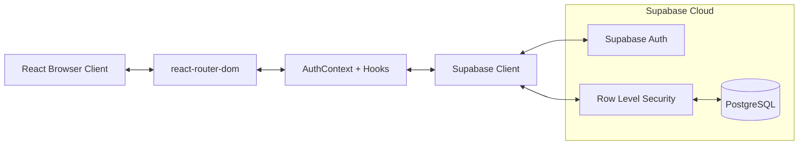
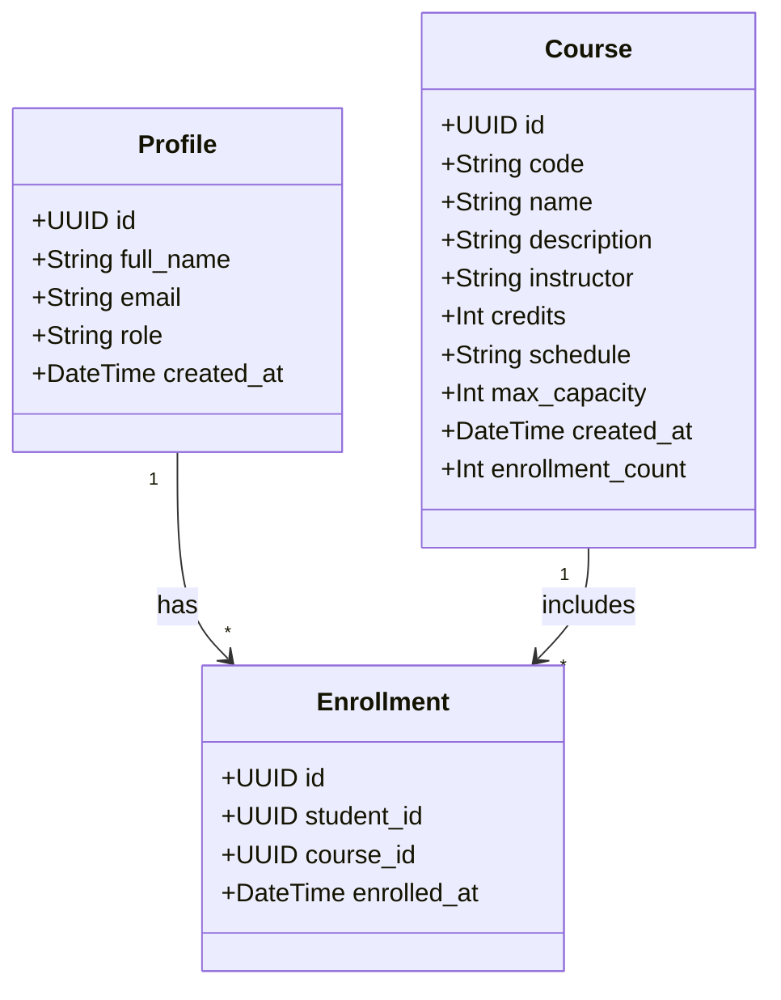
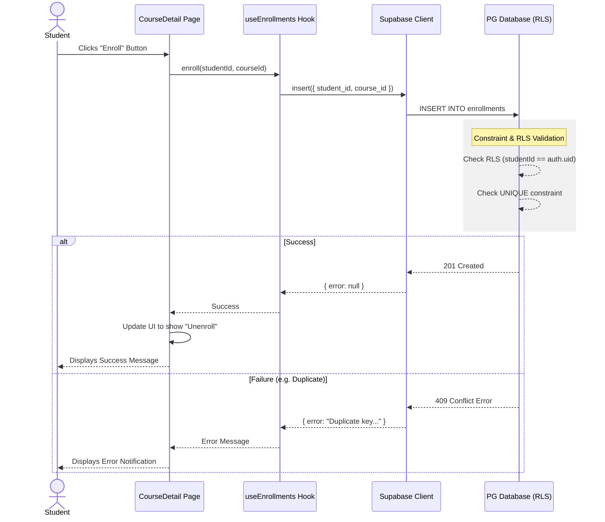
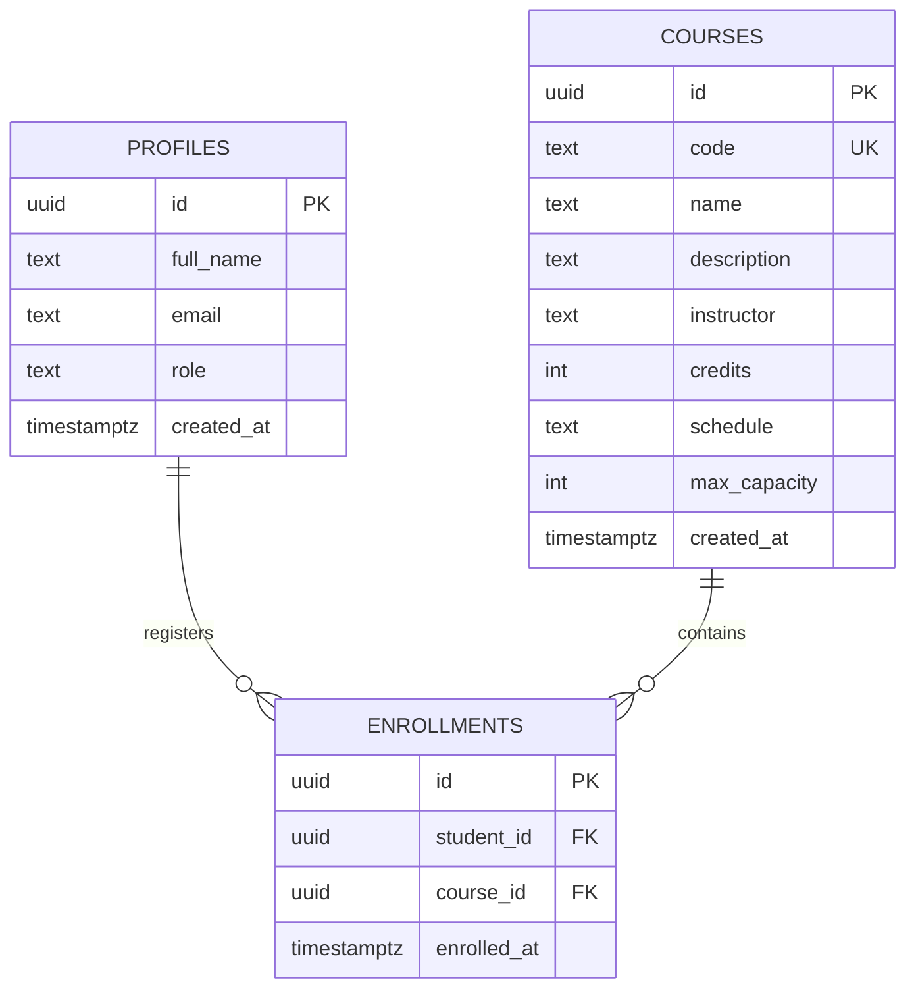

# System Design

## 1. Architecture Diagram

```mermaid
flowchart LR
    Client[React Browser Client]
    Router[react-router-dom]
    Context[AuthContext + Hooks]
    SupabaseClient[Supabase Client]
    
    subgraph Supabase Cloud
        Auth[Supabase Auth]
        DB[(PostgreSQL)]
        RLS[Row Level Security]
    end

    Client <--> Router
    Router <--> Context
    Context <--> SupabaseClient
    
    SupabaseClient <--> Auth
    SupabaseClient <--> RLS
    RLS <--> DB
```

---

## 2. Class Diagram

```mermaid
classDiagram
    class Profile {
        +UUID id
        +String full_name
        +String email
        +String role
        +DateTime created_at
    }

    class Course {
        +UUID id
        +String code
        +String name
        +String description
        +String instructor
        +Int credits
        +String schedule
        +Int max_capacity
        +DateTime created_at
        +Int enrollment_count
    }

    class Enrollment {
        +UUID id
        +UUID student_id
        +UUID course_id
        +DateTime enrolled_at
    }

    Profile "1" --> "*" Enrollment : has
    Course "1" --> "*" Enrollment : includes
```

---

## 3. Sequence Diagram: Student Enrolls in a Course

```mermaid
sequenceDiagram
    actor Student
    participant UI as CourseDetail Page
    participant Hook as useEnrollments Hook
    participant Supabase as Supabase Client
    participant DB as PG Database (RLS)

    Student->>UI: Clicks "Enroll" Button
    UI->>Hook: enroll(studentId, courseId)
    Hook->>Supabase: insert({ student_id, course_id })
    Supabase->>DB: INSERT INTO enrollments
    
    rect rgb(240, 240, 240)
        Note over DB: Constraint & RLS Validation
        DB-->>DB: Check RLS (studentId == auth.uid)
        DB-->>DB: Check UNIQUE constraint
    end
    
    alt Success
        DB-->>Supabase: 201 Created
        Supabase-->>Hook: { error: null }
        Hook-->>UI: Success
        UI->>UI: Update UI to show "Unenroll"
        UI-->>Student: Displays Success Message
    else Failure (e.g. Duplicate)
        DB-->>Supabase: 409 Conflict Error
        Supabase-->>Hook: { error: "Duplicate key..." }
        Hook-->>UI: Error Message
        UI-->>Student: Displays Error Notification
    end
```

---

## 4. Entity Relationship Diagram (ERD)

```mermaid
erDiagram
    PROFILES ||--o{ ENROLLMENTS : "registers"
    PROFILES {
        uuid id PK
        text full_name
        text email
        text role
        timestamptz created_at
    }

    COURSES ||--o{ ENROLLMENTS : "contains"
    COURSES {
        uuid id PK
        text code UK
        text name
        text description
        text instructor
        int credits
        text schedule
        int max_capacity
        timestamptz created_at
    }

    ENROLLMENTS {
        uuid id PK
        uuid student_id FK
        uuid course_id FK
        timestamptz enrolled_at
    }
```
