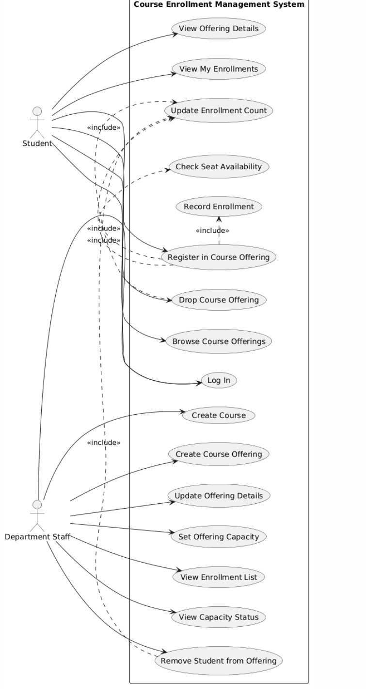

# Use Cases

## 1. Use Case List

| Use Case ID | Use Case Name | Actor | Brief Description |
|---|---|---|---|
| **UC01** | Enroll in a Course | Student | A student browses available courses and registers for a specific course that has available seats. |
| **UC02** | Create Course | Admin | An administrator adds a new course to the university catalog with capacity and schedule details. |
| **UC03** | View Enrollments | Admin | An administrator views the roster of all students currently enrolled in a specific course. |
| **UC04** | Remove Student | Admin | An administrator forcibly unenrolls a student from a course roster. |
| **UC05** | Filter Course Catalog | Student | A student searches and filters the course list to find relevant classes. |

---

## 2. Detailed Use Case: UC01 "Enroll in a Course"

* **Use Case ID**: UC01
* **Use Case Name**: Enroll in a Course
* **Actor**: Student
* **Description**: The student views the details of a specific course and clicks a button to register for it, adding it to their timetable.

### Preconditions
1. The student is logged into the system with a valid "student" role account.
2. The course exists in the system.

### Postconditions
1. The student is recorded as enrolled in the course.
2. The course's active enrollment count increases by one.

### Main Success Scenario
1. The student navigates to the Course Catalog (`/courses`).
2. The student clicks on a specific course to view its details.
3. The system displays the course information, confirming there are available seats.
4. The student clicks the "Enroll" button.
5. The system records the enrollment in the database.
6. The system updates the UI to show an "Unenroll" button and displays a success notification.

### Alternative Flow A: Course is at full capacity
1. At Step 3, the system displays that the course is at maximum capacity.
2. The system disables the "Enroll" button and displays it as "Course Full".
3. The student cannot proceed with enrollment.

### Alternative Flow B: Student already enrolled
1. At Step 3, the system recognizes the student is already registered for this course.
2. The system displays an "Unenroll" button instead of an "Enroll" button.
3. The student cannot enroll again (preventing duplicate registration).

### Alternative Flow C: Student not authenticated
1. If the student attempts to access the course catalog or details without being logged in, the system redirects them to the `/login` screen.

---

## 3. Brief Use Case Descriptions

### UC02: Create Course
An administrator logs in and navigates to the "Manage Courses" interface. They select the option to create a new course and fill out a form detailing the code, name, instructor, capacity, and schedule. Upon submission, the course is immediately available in the catalog for students.

### UC03: View Enrollments
An administrator logs in and views the course list. They select a specific course and choose to view its roster. The system displays a table listing the full names, emails, and enrollment dates of all students currently registered for that specific class.

---

## 4. Use Case Diagram Representation

The following diagram provides a comprehensive visual representation of the system's actors and use cases:

